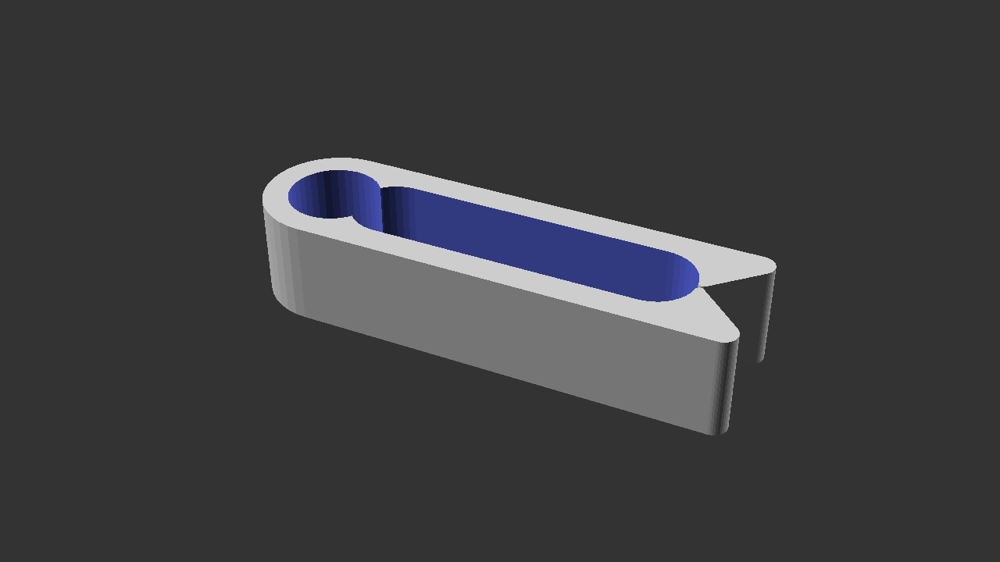
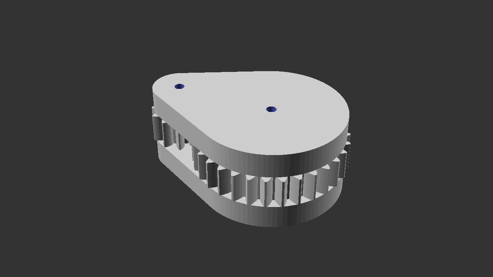
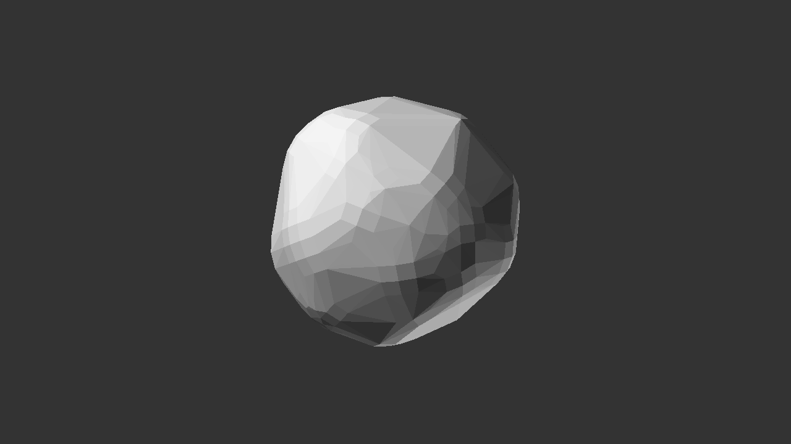
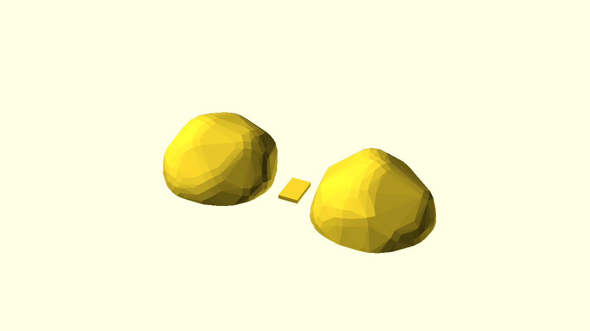
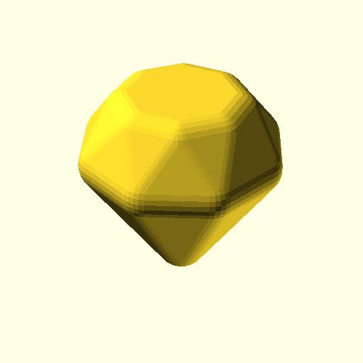
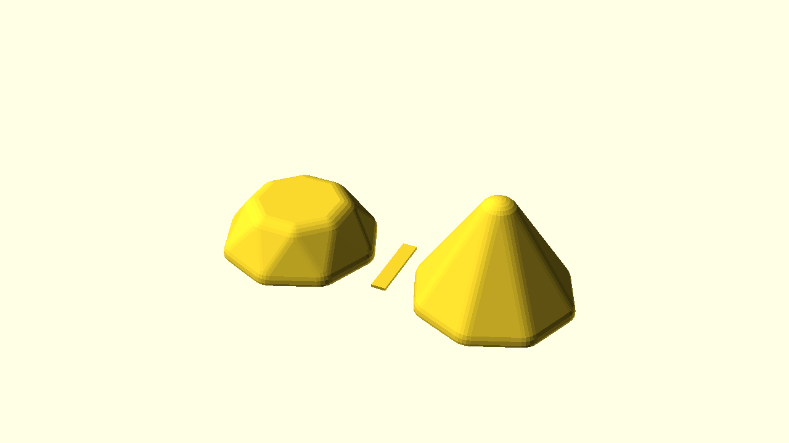
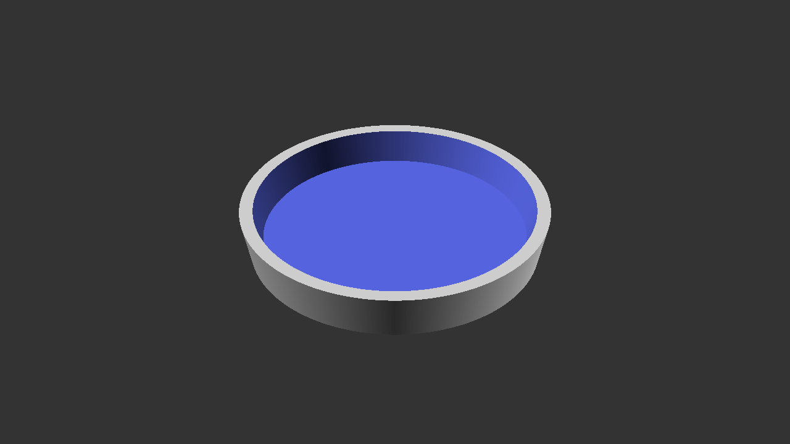
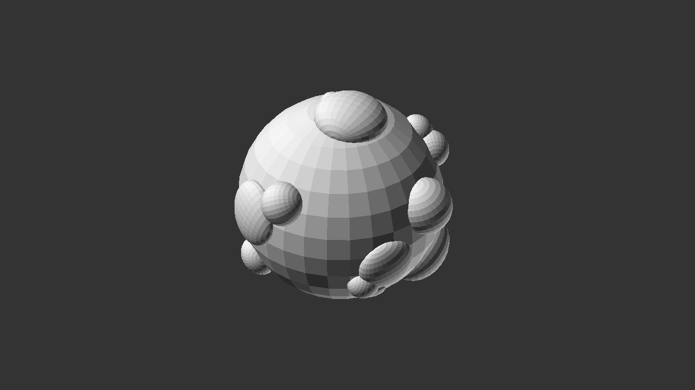

# OpenSCAD Projects

A random assortment of maybe interesting, maybe useful objects.

Some of these are just experiments for learning, others are designed for 3D printing.


## Cable Clip

This is probably the most useful project!
It's a parameterized cable clip.
It's had multiple revisions and tweaks, and it's been printed lots of times,
and I use it a lot to clip my various narrow cables into loops.



The primary design features of this clip are:

* Parameterized - print a custom clip to match your cable diameter and length!
* Quick print. I wanted a clip I could print in about 3 minutes per clip.
* PLA or PETG. I've printed this in both materials. I feel like PETG is probably stronger because it has more flex, but both work fine.

To create a clip for a 3mm thick cable with 4 loops hooked through the clip, set `g_cable_d` to 3, and `g_cable_loops` to 4. On the command line, use the following flags:

```shell
    OpenSCAD -o my_custom_clip -D "g_cable_loops=4" -D "g_cable_d=3" cable_clip.scad
```

## Fidget Cog Toy

Yet another fidget toy.
Just an opportunity to play with the [BOSL library's]() [involute gear functions]().
You will need to have that library installed to create this model.



It's an easy print, in 3 parts, and you push some 1.75mm filament through the two holes to form axles for the cogs.

## Blobby

This should really be renamed pebble.

The project uses randomness to generate non-uniform, vaguely spherical objects.
It does this by randomly projecting different spheres so they touch a given radius,
and then forming a convex [hull](https://en.wikibooks.org/wiki/OpenSCAD_User_Manual/Transformations#hull) over all the spheres.
It makes nicely tactile object, but does take 20 seconds to calculate a pebble on my 2019 13" MacBook Pro.



The really clever stuff in _this_ project, is actually the `blob_preparation.scad` script,
which takes the generated blob, splits it in two, and prepares it for printing, along with
a [biscuit](https://en.wikipedia.org/wiki/Biscuit_joiner) to help align the parts.



I'm not really sure what the project is _for_,
unless you want to creat custom tokens for a game or something, 
but I really like the results
\- they're super tactile.


## Diamond

Another project that heavily uses the [hull](https://en.wikibooks.org/wiki/OpenSCAD_User_Manual/Transformations#hull) transformation,
which I learned about quite late in my OpenSCAD journey!



This is another project where I've written the code to split the model in two and add a slot for a biscuit to line the pieces up.



## Flower Pot Tray

I have a flower pot with a hole in the bottom,
so it needed a tray to sit on.
This was a quick and dirty hacky model.
Quicker than heading to the nearest plant shop!



## Wart Sphere

What even is this?

Is it art?

Probably not.

It was a first attempt to play with randomness in object design,
probably better explored in my later project, [blobby](blobby).

