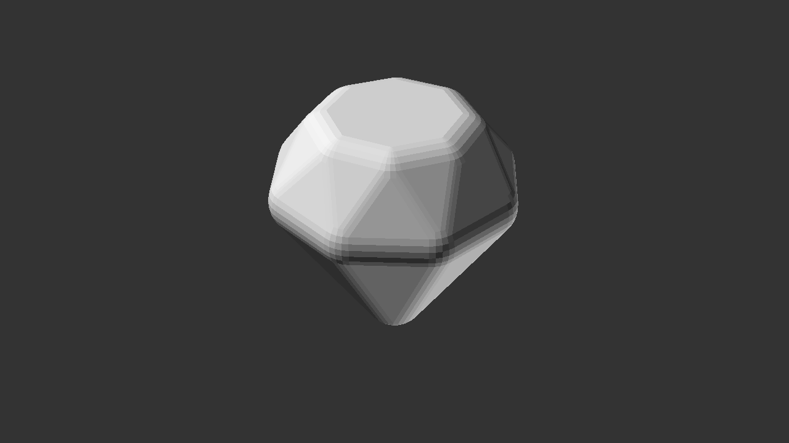

# OpenSCAD Projects

A random assortment of maybe interesting, maybe useful objects.

Some of these are just experiments for learning, others are designed for 3D printing.

## Blobby

This should really be renamed pebble.

The project uses randomness to generate non-uniform, vaguely spherical objects.
It does this by randomly projecting different spheres so they touch a given radius,
and then forming a convex [hull](https://en.wikibooks.org/wiki/OpenSCAD_User_Manual/Transformations#hull) over all the spheres.
It makes nicely tactile object, but does take 20 seconds to calculate a pebble on my 2019 13" MacBook Pro.

The really clever stuff in _this_ project, is actually the `blob_preparation.scad` script,
which takes the generated blob, splits it in two, and prepares it for printing, along with
a [biscuit](https://en.wikipedia.org/wiki/Biscuit_joiner) to help align the parts.

## Diamond

Another project that heavily uses the [hull](https://en.wikibooks.org/wiki/OpenSCAD_User_Manual/Transformations#hull) transformation,
which I learned about quite late in my OpenSCAD journey!

This is another project where I've written the code to split the model in two and add a slot for a biscuit to line the pieces up.

